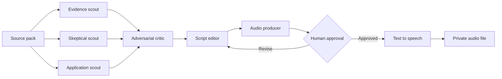

# Evidence to Audio

Evidence to Audio is a transparent multi-agent pipeline that turns a source pack into a private spoken-word brief.

Independent scouts identify the strongest ideas. An adversarial critic decides what deserves time. A script editor writes for the ear. A producer removes repetition and prepares the final narration. Only after human approval does a text-to-speech engine create the audio file.

**Status: experimental reference implementation. Review every script before narration. Do not put private material into a hosted model or speech service without understanding where the text goes.**

## The argument

Most AI podcast workflows optimize for conversion: put documents in, get audio out. That is the easy part.

The harder problem is editorial judgment. What deserves the listener's time? Which claim is supported? Which source is selling something? What should be cut? What caveat needs to remain audible? A fluent voice can make weak analysis sound authoritative.

This project treats the script as the product and the audio file as the final format. It preserves the disagreement, evidence, and decisions that produced the script.

## How it works



Every stage writes an inspectable artifact:

```text
runs/20260822T140000Z/
├── scouts/
│   ├── application.md
│   ├── evidence.md
│   └── skeptic.md
├── critic.md
├── draft-script.txt
├── script.txt
└── manifest.json
```

The audio renderer is a separate command. A completed script does not automatically leave the machine.

## What makes this different

- **No source quotas.** A small publication can lead when it contributes the strongest idea.
- **Independent scouting.** Scouts see the same source pack but use different evaluation frames.
- **A real critic.** The critic can kill attractive material, challenge vendor incentives, and recommend a shorter episode.
- **A runtime ceiling.** Ninety minutes is the maximum, never a target.
- **Evidence before eloquence.** The pipeline keeps claims, limits, and source files visible before producing polished narration.
- **Audience before jargon.** A listener profile and one-to-ten technicality ceiling shape idea selection before the script is written.
- **Human authority.** Audio generation requires a separate command and an explicit external-service acknowledgement.
- **Provider choice.** Agents can use any OpenAI-compatible endpoint, including a local model server or a hosted provider.
- **Private by default.** Generated runs and audio files are ignored by Git.

## Quick start

Requirements:

- Python 3.11 or newer.
- An OpenAI-compatible chat-completions endpoint.
- Optional [`edge-tts`](https://github.com/rany2/edge-tts) for neural narration.

Clone the project and create a working configuration:

```bash
git clone https://github.com/wayanvota/evidence-to-audio.git
cd evidence-to-audio
cp config.example.toml config.toml
python3 -m pip install -e .
```

Edit `config.toml` with your model endpoint and model name. The example points to a local endpoint and does not require an API key. For a hosted provider, name an environment variable in `api_key_env` and set the key outside the configuration file.

Also edit the `[audience]` section. The default profile is a business builder who gives AI agents direction, lets them build and test, and reviews the evidence. Its technicality target is three out of ten.

Run the editorial pipeline on the synthetic example sources:

```bash
evidence-to-audio run \
  --config config.toml \
  --sources examples/source-pack
```

Review the resulting files, especially `critic.md` and `script.txt`. Then validate the run:

```bash
evidence-to-audio validate --run runs/YOUR_RUN_ID
```

To use the optional neural narrator:

```bash
python3 -m pip install edge-tts

evidence-to-audio render \
  --config config.toml \
  --run runs/YOUR_RUN_ID \
  --approve-external-tts
```

That acknowledgement is required because the renderer sends the script to an external speech service. If your source pack is sensitive, use a local speech engine or stop at the approved script.

## Try the example without a model

The repository includes a completed synthetic run under [`examples/sample-run`](examples/sample-run). It demonstrates the expected artifacts using a fictional city cooling pilot. No real person, organization, vendor, or private brief appears in the example.

Validate it with:

```bash
python3 -m evidence_to_audio validate --run examples/sample-run
```

The installed CLI is also covered by a 20-category end-to-end contract using
an in-process fake OpenAI-compatible endpoint. It makes no external provider or
speech calls. See the [end-to-end test report](E2E-TEST-REPORT.md) for the
cases, commands, debugging steps, and extension rules.

## Customize the agent team

Agent roles live in `config.toml`, and their standing instructions live under `prompts/`.

You can:

- Add scouts for legal risk, scientific evidence, practitioner experience, local context, or cost.
- Assign different providers or models to different agents.
- Replace every default prompt without changing the orchestration code.
- Lower the runtime ceiling for a daily or narrow-topic brief.
- Change the narration voice, speed, pitch, format, or engine.

Do not add agents merely to create the appearance of rigor. A new role should have a distinct question, evidence standard, or decision right.

## Source-pack rules

The pipeline reads Markdown, text, and JSON files. Keep source collection separate from editorial synthesis. This project does not crawl websites, bypass subscriptions, or guess whether material may be reused.

A useful source file includes:

- Publication date.
- Source title and origin.
- The relevant text or a lawful summary.
- Working source links when appropriate.
- Notes about incentives, methodology, and access limits.

Do not include credentials, confidential documents, personal data, copyrighted full-text material you cannot lawfully process, or information you would not send to the configured model provider.

## Output discipline

The final script must:

- Stay below the configured runtime ceiling.
- Stay at or below the configured audience technicality target.
- Contain no spoken URLs.
- Preserve material uncertainty.
- Attribute consequential claims.
- Avoid repeated introductions and conclusions.
- End when the valuable material ends.

The validator checks structure, script length, manifest consistency, and spoken URLs. It cannot determine whether the analysis is true. Human review remains responsible for source quality, fair use, defamation risk, confidentiality, and editorial judgment.

## Privacy and cost

The core Python package has no required third-party dependencies. Model and narration costs depend on the endpoints you choose.

The default neural-audio example uses the community [`edge-tts`](https://github.com/rany2/edge-tts) package, which connects to Microsoft's online speech service without a personal API key. It is convenient for experimentation, but it is still an external service and may change without notice. Review [`docs/privacy-and-cost.md`](docs/privacy-and-cost.md) before using it with real material.

Generated runs, environment files, and common audio formats are excluded by `.gitignore`.

## Project boundaries

Evidence to Audio does not:

- Decide whether a claim is true.
- Replace source verification or human editing.
- Publish a podcast feed.
- Upload files to a public host.
- Manage subscriptions, copyrighted feeds, or paywalled material.
- Guarantee that separate agents are independent when they share the same model or training data.
- Make a private workflow safe merely because it runs on one computer.

## Why I built this

I wanted an audio brief that respected the listener's time. That required more than summarization and a pleasant voice. The system needed independent collection, explicit skepticism, source traceability, spoken-word editing, and permission boundaries.

The reusable idea is the editorial architecture. The subject can change. The models can change. The voice can change. The discipline should remain visible.

## Repository policy

Safe to publish:

- Orchestration code.
- Agent prompts.
- Synthetic examples.
- Documentation and tests.

Keep private:

- Real source packs when reuse is restricted.
- Personal profiles and listening preferences.
- Model and speech credentials.
- Generated scripts and audio unless deliberately cleared for sharing.
- Private feed addresses.

See [`SECURITY.md`](SECURITY.md) for reporting and privacy guidance.

## Contributing

Contributions are welcome when they improve evidence quality, provider portability, validation, privacy, or listening value. Read [`CONTRIBUTING.md`](CONTRIBUTING.md) before opening a pull request.

## License

Released under the [MIT License](LICENSE).
